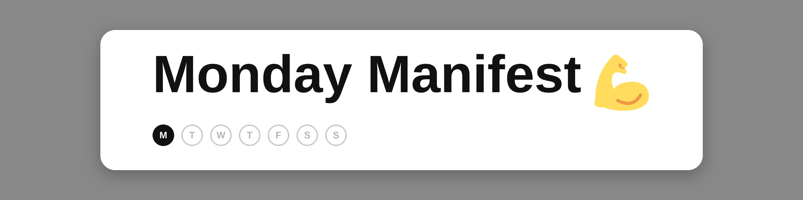
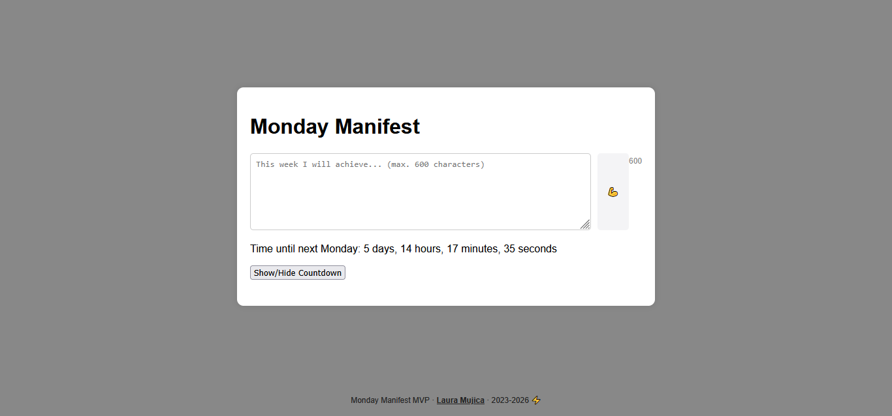

# Monday Manifest

A weekly commitment app built on one idea: **one intention per week, seven days to follow through.**

🔗 **Live demo:** [laumujica.github.io/mondaymanifest](https://laumujica.github.io/mondaymanifest/)
🚧 **Status:** MVP, work in progress · Started November 2023

## The idea

Most habit and productivity tools ask people to track everything, every day. That often leads to overwhelm, guilt and abandoned apps.

Monday Manifest goes the other way:

- **One commitment per week.** You choose a single thing to accomplish.
- **Seven days to complete it.** No daily pressure, just a clear window.
- **A new commitment unlocks only next Monday.** Until then, the current one is the only one that matters.
- **If you don't finish, it stays pending.** There is no "failed" state and no streak to lose. The commitment is still there, waiting.

## Design principles

This is a small project, but it's built around how I think about products for wellbeing and habit formation:

- **Constraint over complexity.** Limiting choices reduces decision fatigue.
- **Small, specific commitments.** One clear intention is easier to act on than a long list.
- **Weekly rhythm.** A week is long enough to be realistic and short enough to stay present.
- **No punishment loops.** Unfinished doesn't mean failed. Users are not shamed for missing a goal.
- **Ritual.** Monday becomes a deliberate moment to decide what matters this week.

## About this project

I started Monday Manifest on **November 16, 2023**, and it's still a work in progress. I keep building it because I love creating digital products: turning an idea into something people can use, and refining it over time.

AI has changed how I work on it. Today it helps me improve the product and make it grow in ways I couldn't at the start.

## Current status: MVP

Built to validate the core interaction before adding features.

**Working today**
- Commitment entry limited to Mondays
- Live character counter (600 max)
- Live countdown to next Monday, with show/hide toggle
- Checkbox completion that locks once checked

**In progress**
- [ ] Limit to one active commitment at a time
- [ ] Keep an unfinished commitment pending until it's completed
- [ ] Enforce the 7-day window and the next-Monday unlock
- [ ] Persist data between sessions
- [ ] Fix the countdown on Mondays themselves
- [ ] Optional weekly reflection after completion

## Tech stack

Vanilla **HTML, CSS and JavaScript**. No frameworks, no build step.

---

Laura Mujica · 2026 ⚡  
[lauramujica.com](https://lauramujica.com/)
